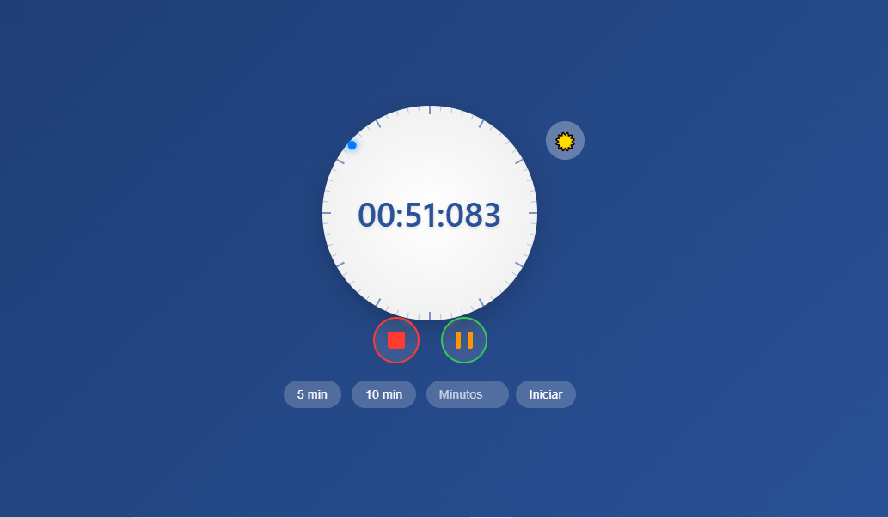
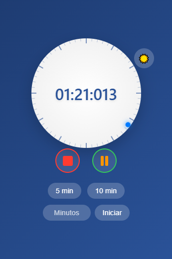
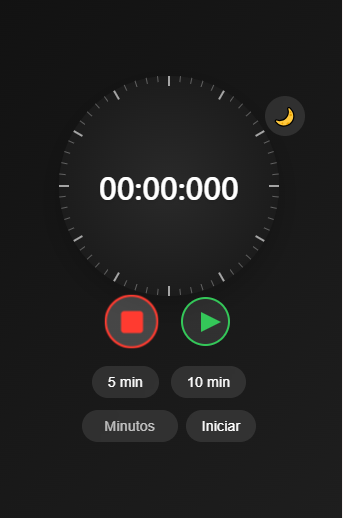

# Cronómetro Web Interactivo

Un cronómetro web moderno, interactivo y responsivo diseñado con HTML, CSS, y TypeScript.

---

## 📋 Índice

1. [Descripción](#descripción)
2. [Características](#características)
3. [Capturas de pantalla y modos de visualización](#capturas-de-pantalla-y-modos-de-visualización)
4. [Funcionalidades](#funcionalidades)
5. [Estructura del proyecto](#estructura-del-proyecto)
6. [Tecnologías utilizadas](#tecnologías-utilizadas)
7. [Licencia](#licencia)

---

## 📖 Descripción

Este cronómetro interactivo ha sido desarrollado con **HTML**, **CSS** y **TypeScript**, presentando un diseño moderno y responsivo. Ofrece animaciones visuales atractivas, donde un pequeño círculo gira alrededor de la esfera del reloj para indicar los segundos transcurridos. Una vuelta completa de la esfera equivale a un minuto. Incluye también un interruptor para alternar entre modo claro y modo oscuro.

---

## ✨ Características

- **Iniciar/Pausar el cronómetro** con animaciones fluidas.
- **Reiniciar el tiempo** con un botón dedicado.
- **Modo claro y oscuro** para una experiencia adaptable.
- **Diseño responsivo** optimizado para dispositivos móviles y pantallas grandes.
- **Esfera animada** que rota alrededor del reloj indicando los segundos.

---

## 🖼️ Capturas de pantalla y modos de visualización

A continuación, se presentan capturas de pantalla que muestran los diferentes modos visuales (día y noche) en distintas plataformas.

### Modo día

Un diseño claro y minimalista para condiciones de buena iluminación.

#### Vista en PC


#### Vista en móvil


---

### Modo noche

Un diseño oscuro que reduce la fatiga visual en ambientes con poca luz.

#### Vista en PC


#### Vista en móvil


---

## 🚀 Funcionalidades

1. **Iniciar y pausar el cronómetro**:
   - Botón de Play: Inicia la cuenta y activa la animación de rotación.
   - Botón de Pausa: Detiene la cuenta sin reiniciar el cronómetro.

2. **Reiniciar el tiempo**:
   - Botón de Stop: Reinicia el cronómetro a `00:00` y detiene todas las animaciones.

3. **Animaciones suaves**:
   - Una esfera gira siguiendo el borde del círculo, indicando los segundos transcurridos.

4. **Modo claro y oscuro**:
   - Alterna fácilmente entre un diseño brillante y otro más tenue para adaptarse al entorno.

5. **Diseño responsivo**:
   - Perfectamente adaptable para dispositivos móviles y pantallas de escritorio.

---

## 📂 Estructura del proyecto

```plaintext
Proyecto Cronómetro/
├── dist/                 # Código JavaScript compilado
│   └── cronometro.js
├── src/                  # Archivos fuente TypeScript
│   └── cronometro.ts
├── assets/               # Recursos estáticos (imágenes, capturas, etc.)
│   ├── modo-dia-pc.png
│   ├── modo-dia-movil.png
│   ├── modo-noche-pc.png
│   └── modo-noche-movil.png
├── index.html            # Estructura HTML
├── cronometro.css        # Estilos CSS
├── README.md             # Documentación del proyecto
└── tsconfig.json         # Configuración de TypeScript
 ```
 
## 🛠️ Tecnologías utilizadas

- **HTML5**: Estructura de la aplicación.
- **CSS3**: Estilos visuales y animaciones avanzadas.
- **TypeScript**: Lógica del cronómetro y comportamiento dinámico.
- **JavaScript**: Código compilado para ejecución en el navegador.

---
## 📜 Licencia

Este proyecto está bajo la licencia **MIT**. Esto significa que puedes usar, modificar y distribuir el código libremente, siempre y cuando incluyas una copia de la licencia original en cualquier distribución del proyecto.

Consulta el archivo `LICENSE` para obtener más detalles.
